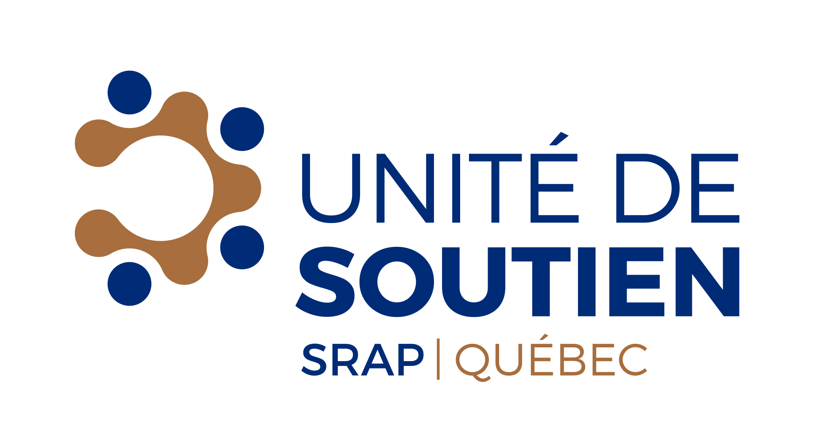

# Welcome to the **Understanding Research** platform
The **Understanding Research** platform aims to help people understand the basic concepts of research. Understanding research concepts is known as **research literacy**. It establishes a common language among patients, managers, clinicians and researchers who may collaborate on a research project.

## What is research literacy?
**Research literacy** is defined as being sufficiently familiar with scientific ethics and methods to understand basic research concepts (knowledge), communicate with researchers and research participants (behavior), and respect research ethics (attitude). This definition is adapted from Nebeker and López-Arenas (2016).

## Who is this platform for?
**Understanding Research** is intended for patients, managers, clinicians and anyone interested in research and collaboration with researchers (stakeholders).

## Why this platform? 
* Help stakeholders understand and use a common research language
* Enable research teams, patients and members of the public to properly prepare their partnerships
* Guide research teams, patients and members of the public through the important steps of research
* Enable research teams, patients and members of the public to have access to several external references that will help them in their partnerships.

## How is this platform organized?
The platform consists of **this website** in conjunction with an <a href="https://osf.io/p4bsy/" target="_blank">**Open Science Framework (OSF) repository**</a>. The website provides textual content on research literacy, while the OSF repository provides public access to the training materials we have developed, all available under a Creative Commons license. The OSF repository also contains a workbook with expanded information for each topic covered on this website.

The platform is organized into the following themes:

* **Research:** An introduction to science, research, literature reviews and ethics
* **Methodology:** An explanation of qualitative, quantitative, and mixed methods
* **Knowledge Translation:** An introduction to evidence synthesis, dissemination, and how to read a scientific article

### What is in the Open Science Framework repository?
The Open Science Framework repository hosts our research literacy training materials, including:

* PowerPoint slides for research literacy workshops
* Accompanying workbook for participants - <a href="https://osf.io/u79yp/" target="_blank">Download booklet</a>
* Brief videos explaining various concepts

## Who are we?
The mission of the **Quebec SPOR Support Unit** is to contribute to meeting the needs of patients and stakeholders in the health and social services network through concrete actions and to build a critical mass of multidisciplinary methodological expertise aligned with these needs. 

Within the Quebec SPOR Support Unit are the **Method Developments** and **Research Strategy in Partnership with Patients and the Public** components. 

The **<a href="http://unitesoutiensrapqc.ca/composante/developpements-methodologiques/" target="_blank">Method Development Component</a>** aims to meet the needs of researchers, patients, clinicians and managers for advanced methods (methodological and technical approaches) for the planning, conduct and evaluation of patient-oriented research. 

The **<a href="http://unitesoutiensrapqc.ca/composante/strategie-de-recherche/" target="_blank">Patient and Public Partnership Strategy unit</a>** aims to develop centres of expertise throughout Québec based on the methodology developed by the four Réseau universitaires intégrés en santé (RUIS) du Québec.  

The Strategy for Patient-Oriented Research (SPOR) was developed in partnership with researchers, clinicians, decision-makers, patients, members of different communities and citizens. 

**For more information: <a href="http://unitesoutiensrapqc.ca/" target="_blank">http://unitesoutiensrapqc.ca/</a>**

## References
Nebeker C, López-Arenas A. Building research integrity and capacity (BRIC): an educational initiative to increase research literacy among community health workers and promotores. Journal of Microbiology & Biology Education. 2016 Mar;17(1):41.

## Copyrights and usage
This knowledge product entitled **Understanding Research** is protected by copyright and belongs to the authors.

This knowledge product is available for use under **<a href="https://creativecommons.org/licenses/by-nc-sa/4.0/" target="_blank">Creative Commons Public License Attribution-NonCommercial-ShareAlike 4.0 International</a>**.

If you are planning to use any material from Understanding Research, please let us know who you are and how you plan to use it. This information is very important to us for evaluating its use and impact. You can write to us at **supportunit [dot] fammed [at] mcgill [dot] ca**.​

## Sponsors
This initiative is sponsored by the <a href"http://unitesoutiensrapqc.ca/composante/developpements-methodologiques/" target="_blank"> Quebec SPOR SUPPORT Unit, Method Development component</a>; the <a href="https://ceppp.ca/en/" target="_blank">Centre of Excellence on Partnership with Patients and the Public (CEPPP)</a>; the <a href="http://unitesoutiensrapqc.ca/composante/strategie-de-recherche/" target="_blank">Patient and Public Partnership Strategy for the Quebec SPOR SUPPORT Unit</a>, and the <a href="https://www.mcgill.ca/familymed/" target="_blank">McGill Department of Family Medicine</a>.

