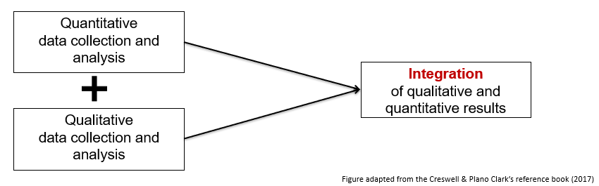
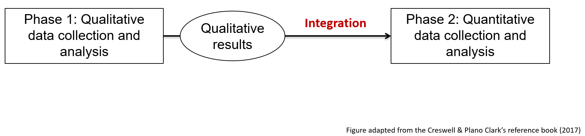
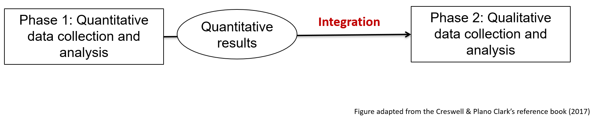

# Mixed methods research
## What are mixed methods

Mixed method research refers to the combination and integration of qualitative and quantitative methods in the same study or research.

| | |
| ---- | ---- |
| Integration | Integration of qualitative and quantitative in the data collection and analysis process is key in mixed methods (not the simple addition of 2 distinct studies)| 
| Strategy | Mixed methods is used when this strategy allows researchers to better address a research question |

When a qualitative study appears alongside a quantitative study in a research study, it is not necessarily a mixed methods research per se. In other words, the mixed methods research does not propose the simple addition of separate qualitative and quantitative studies. Rather, mixed methods research seeks to integrate both quantitative and qualitative components in the same study to answer the same general research question. **Integration is therefore a key element of the mixed methods research. It refers to the interface point between the quantitative and qualitative components in a mixed methods research.** 

## When to use mixed methods
Mixed methods are used when integrating qualitative and quantitative information is needed to better answer the research questions. Mixed methods may be chosen when there is a need:

* To interpret quantitative results
* To statistically generalize qualitative results
* To both explore (qualitatively) and to measure (quantitatively) a phenomenon

## Mixed methods designs
Three basic mixed methods research designs are frequently observed.

| Research design | Description | Example | 
| ----- | ----- | ----- |
| Convergent design | Qualitative and quantitative data collection and analysis are done separately, then the results of both are compared or combined | For example, researchers are interested in understanding the barriers and facilitators to the implementation of a new program. To achieve this goal, they decide to conduct a survey with the participants (quantitative) and interviews with the clinicians (qualitative). Then, they compare the results found for each method.  |
| Sequential exploratory design | The first phase is qualitative. The qualitative results inform the data collection of the second phase, which is quantitative. | This design can be used to develop a measurement tool. First, interviews will be conducted to generate a list of items considered important by experts and create a first version of the measurement tool. Then, a quantitative study is conducted to study the psychometric properties of this tool (e.g. factor analysis). |
| Sequential explanatory design | In this design, the first phase is quantitative. The quantitative results inform the data collection of the second phase, which is qualitative. | A quantitative study is conducted to study the effectiveness of an intervention. Then, a qualitative study is conducted to explain why the intervention did not work for some participants. |

###Convergent Design

*Above: Diagram of convergent design*

###Sequential Exploratory Design
 Qualitative results > Integration into Phase 2: Quantitative data collection and analysis. Figure adapted from the Creswell & Plano Clark's reference book (2017)." width="75%" />

*Above: Diagram of sequential exploratory design*

###Sequential Explanatory Design
 Quantitative results > Integration into Phase 2: Qualitative data collection and analysis. Figure adapted from the Creswell & Plano Clark's reference book (2017)." width="75%" />

*Above: Diagram of sequential explanatory design*

## Advantages and challenges of mixed methods
| Advantages | Challenges |
| ----- | ----- |
| The strengths of each type of method can compensate for the limits of the other | The research process can be complex and require a significant amount of time and resources|
| Mixed methods research provides a more complete and in-depth understanding of the studied phenomenon than a quantitative or qualitative approach alone | Can potentially require additional training and equipment (e.g., specialized software) |

Quantitative research will generally provide access to one or more explanations that are more general and give measures, generalizable descriptions, general trends (e.g., statistical analyses on a large group of people). 

Qualitative research will generally provide access to a more in-depth understanding of complex phenomena in a specific context (e.g., individual interviews to understand the perspective of members of a social group). 

By combining the two, mixed methods research can potentially compensate for the limitations of each method in understanding a phenomenon in both its general and specific aspects. 

Mixed methods allow a more complete and in-depth understanding of the phenomenon under study than a quantitative or qualitative approach used alone. The idea here is that by combining and integrating the strengths of qualitative and quantitative methods, it will be possible to better explain the complexity of a phenomenon. However, this requires researchers or research teams to have a good understanding of both qualitative and quantitative methods.

**Thank you for helping us improve this section by completing <a href="https://forms.gle/MT1vwEQyMFTuaYd9A" target="_blank">a short survey</a>.**

## Additional resources
* **<a href="https://www.youtube.com/watch?v=1OaNiTlpyX8" target="_blank">What is mixed methods research?</a>**: YouTube video from John Creswell (15 minutes)
