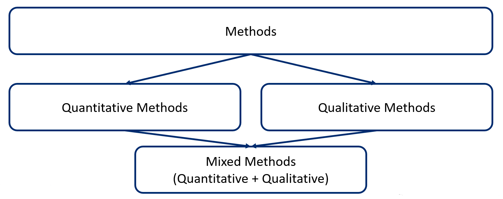

# Methodology
There are three general categories of research methods:

* Quantitative
* Qualitative
* Mixed methods

Please <a href="https://osf.io/4sdtm/" target="_blank" >see our video</a> about types of research methods.

## Quantitative research
**Quantitative research is useful for studying measurable phenomena.** It tries to explain phenomena by collecting data, and analyze them using mathematical methods, especially statistics.  

In health research, quantitative research can answer the questions such as:

* How many cases of a disease exist in a popuplation?
* What proportion of people with a disease survives 5 years after the diagnosis? 
* Does a new treatment decrease the symptoms of a disease compared to the traditional treatment?

### Goals of quantitative research

The central goal of quantitative research is the generalization of findings. It is often impossible to study a whole population. Generally, we will study a representative sample of that population. Generalization means that the researchers will extend the results founds from a sample to the whole population. 

Quantitative research also allows to study hypotheses using statistical tests. For example, a researcher can be interested in comparing the following two hypotheses: 

* The influenza vaccine reduces the number of hospitalizations per year, and 
* The influenza vaccine does not reduce the number of hospitalizations per year

To test these hypotheses, a quantitative study can be performed to compare the number of elderly people hospitalized among those who have been vaccinated and those who have not been vaccinated. Statistical tests are used to compare the groups, which consider the sample size and variability of the observed results. It will tell us the probability that the observed results are due to chance or not. 

It is very important to note that it is always possible to obtain incorrect "results" in quantitative research. A methodological error can very easily lead to erroneous conclusions. Thus, rigour of the methods is particularly important.

### Types of quantitative health research

| Field | Study | Example |
| ------------- | ------------- | ---------- |
| Biomedical science | To study living organisms, their responses to disease processes and therapies | Does the new antibiotic kill more germs than the old one? |
| Clinical research | To study the efficacy and safety of treatments and diagnostic products | Does the new antibiotic treat a disease faster compared to traditional treatment? |
| Public health research | To study disease prevention and health promotion | Does the use of the new antibiotic reduce the number of hospitalizations? |
| Health services research | To answer health services questions | Did doctors prescribe the new antibiotic to patients in need? |

### Study designs

There are two general types of study designs within quantitative methods:

* Experimental
* Observational

Within these, there are several subtypes.

| Type | Study design | Example |
| --------- | --------- | --------- |
| Experimental | Randomized controlled trial | Researchers determine, through a controlled process, the exposure for each individual (clinical trial) or community (community trial), and then track the individuals or communities over time to detect the effects of the exposure; participants are allocated at random to the intervention or control groups |
| Observational | Cohort (longitudinal) | Researchers record whether each study subject is exposed or not, and then track the subjects to see if they develop the disease being studied |
| | Case-control study | Researchers enroll a group of people with the disease (cases) and a group without the disease (controls), then compare previous exposures to different factors between the two groups  |
| | Cross-sectional study | Researchers enroll a sample of people from a population and their exposures and health outcomes are measured simultaneously at a specific point in time |
| | Ecological (population-based) | Researchers measure disease rates and different determinants for each unit (each population), and the relationships between disease rates and determinants are examined |

### Statistics in health research
The observations of the studies are expressed in quantifiable data. Statistics is the analysis and interpretation of quantifiable data. 

**Biostatistics** is the science of collecting and analyzing numerical data in large quantities “for addressing, analyzing and solving problems in public health; health care; and biomedical, clinical and population-based research” (Calhoun, Ramiah, Weist, Shortell, 2008).

Two types of statistics are often used in health research:

* Descriptive statistics
* Inferential statistics

**Descriptive statistics** describes, organizes, summarizes and presents variables and numerical data. They do not allow us to make conclusions beyond the data we have analysed or reach conclusions regarding any hypotheses we might have made. They are simply a way to describe our data. Descriptive statistics are very important because it would be hard to visualize what the data was showing if we simply presented our raw data, especially if there was a lot of it. Therefore, descriptive statistics enables us to present the data in a more meaningful way, which allows simpler interpretation of the data.

**Inferential statistics** are techniques that allow us to use results from samples to make generalizations about the populations from which the samples were drawn. It is, therefore, important that the sample accurately represents the population. 

### Additional resources
Forthcoming.

## Big data and health research
Whereas statisticians and early data scientists were often limited to working with “sample” sets of data, big data has enabled data scientists to access and work with massive sets of data without restriction. Big data has caused the scientific community to re-examine its methodology of scientific research and has triggered a revolution in scientific thinking and methods. Rather than relying on representative data samples, data scientists can now rely on the data itself, in all of its granularity, nuance, and detail. 

For example, artificial intelligence and machine learning have been used to study big data. Although many artificial intelligence technologies have existed for several decades, only now are they able to take advantage of datasets of sufficient size to provide meaningful learning and results. The ability to access large volumes of data with agility and ready access is leading to a rapid evolution in the application of artificial intelligence and machine-learning applications. 

### Additional resources
Articles about the use of big data in health care:

Article: <a href="http://content.healthaffairs.org/content/33/7/1123.short/" target="_blank">Big Data In Health Care: Using Analytics To Identify And Manage High-Risk And High-Cost Patients</a>

Article: <a href="http://jamanetwork.com/journals/jama/fullarticle/1674245" target="_blank">The Inevitable Application of Big Data to Health Care</a>

## Qualitative research
Qualitative research is not used instead of quantitative research. It allows us to answer questions that cannot be answered in the same way through quantitative research. Qualitative data are collected by speaking to people, by observing people and situations, and systematically recording our observations (taking notes, photographs, videos, etc). In this way, qualitative research allows us to gain an in-depth understanding of a phenomenon.

| | Is | Is not|
| ---- | ---- | ---- |
| Objective | To understand a phenomenon | To measure a phenomenon |
| Questions | What? How? Why? | How many? Questions with yes/no answers |
| Data | Words, images, sound(s), interviews, observations | Numbers, questionnaires, survey, documents |

### Transferability
Qualitative research results are not being generalized to larger populations. This is not possible because, among other things, the samples are generally small. The richness of qualitative research is in the level of detail; the depth of the results. 

Transferability is the qualitative “equivalent” of generalizability. The objective is to present the results with enough details for the reader to see if they are transferable in their context.

### Perspectives and dimensions
Not everyone understands or perceives a phenomenon the same way. Qualitative research allows us to examine the different perceptions of those experiencing the phenomenon from different perspectives.

### Frames of reference
When we report the results of a qualitative study, one goal is to make sure our audience understands the phenomenon in the way we intend. The frame of reference we use to analyse and describe a phenomenon can alter the way our audience perceives it.
Qualitative research allows us to understand phenomena in different ways.

### Construction and deconstruction
To understand a phenomenon in qualitative research, we may break it apart into its many "pieces" and fit the "pieces" back together in new ways. For instance, in a qualitative study we tease apart transcriptions of interviews into discreet categories. This data analysis process is referred to as "coding".

### Additional resources
Video overview of qualitative research methods: <a href="https://www.youtube.com/watch?v=IsAUNs-IoSQ" target="_blank">https://www.youtube.com/watch?v=IsAUNs-IoSQ</a>

## Mixed methods research
Mixed method research refers to the combination and integration of qualitative and quantitative methods in the same study or research.

### Challenges of mixed methods
| Challenge | |
| ---- | ---- |
| Integration | Integration of qualitative and quantitative in the data collection and analysis process is key in mixed methods (not the simple addition of 2 distinct studies)| 
| Strategy | Mixed methods is used when this strategy allows researchers to better address a research question |

When a qualitative study appears alongside a quantitative study in a research study, it is not necessarily a mixed methods research per se. In other words, the mixed methods research does not propose the simple addition of separate qualitative and quantitative studies. Rather, mixed methods research seeks to integrate both quantitative and qualitative components in the same study to answer the same general research question. **Integration is therefore a key element of the mixed methods research. It refers to the interface point between the quantitative and qualitative components in a mixed methods research.** 

A mixed methods approach is used when integrating qualitative and quantitative information to better answer research questions. Mixed methods may be chosen when:

* There is a need to interpret quantitative results
* There is a need to statistically generalize qualitative results
* There is a need both to explore (qualitatively) and to measure (quantitatively) a phenomenon

### Mixed methods approaches
Three basic mixed methods research designs are frequently observed.

| Research design | Description | Example | 
| ----- | ----- | ----- |
| Convergent design | Qualitative and quantitative data collection and analysis are done separately, then the results of both are compared or combined | For example, researchers are interested in understanding the barriers and facilitators to the implementation of a new program. To achieve this goal, they decide to conduct a survey with the participants (quantitative) and interviews with the clinicians (qualitative). Then, they compare the results found for each method.  |
| Sequential exploratory design | The first phase is qualitative. The qualitative results inform the data collection of the second phase, which is quantitative. | This design can be used to develop a measurement tool. First, interviews will be conducted to generate a list of items considered important by experts and create a first version of the measurement tool. Then, a quantitative study is conducted to study the psychometric properties of this tool (e.g. factor analysis). |
| Sequential explanatory design | In this design, the first phase is quantitative. The quantitative results inform the data collection of the second phase, which is qualitative. | A quantitative study is conducted to study the effectiveness of an intervention. Then, a qualitative study is conducted to explain why the intervention did not work for some participants. |

### Mixed methods strategy
| Advantages | Challenges |
| ----- | ----- |
| The strengths of each type of method can compensate for the limits of the other | The research process can be complex and require a significant amount of time and resources|
| Mixed methods research provides a more complete and in-depth understanding of the studied phenomenon than a quantitative or qualitative approach alone | Can potentially require additional training and equipment (e.g., specialized software) |

Quantitative research will generally provide access to one or more explanations that are more general and give measures, generalizable descriptions, general trends (e.g., statistical analyses on a large group of people). Qualitative research will generally provide access to a more in-depth understanding of complex phenomena in a specific context (e.g., individual interviews to understand the perspective of members of a social group). By combining the two, mixed methods research can potentially compensate for the limitations of each method in understanding a phenomenon in both its general and specific aspects. 

Mixed methods allow a more complete and in-depth understanding of the phenomenon under study than a quantitative or qualitative approach used alone. The idea here is that by combining and integrating the strengths of qualitative and quantitative methods, it will be possible to better explain the complexity of a phenomenon. However, this requires researchers or research teams to have a good understanding of both qualitative and quantitative methods.

### Additional resources
Video from John Creswell on what is mixed methods research (15 minutes): <a href="https://www.youtube.com/watch?v=1OaNiTlpyX8" target="_blank">https://www.youtube.com/watch?v=1OaNiTlpyX8</a>

## References
Calhoun JG, Ramiah K, Weist EM, Shortell SM. Development of a core competency model for the master of public health degree. American Journal of Public Health. 2008 Sep;98(9):1598-607, p.1602.

