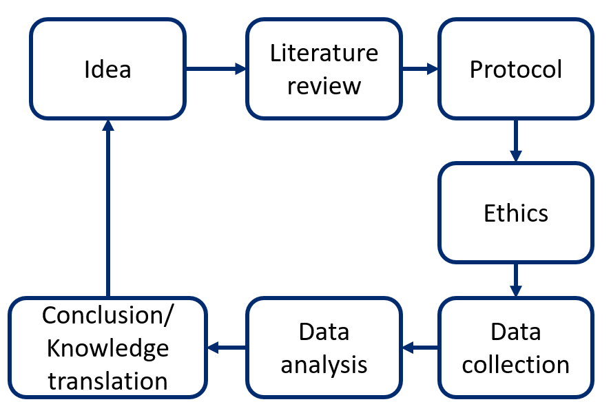

# Research

## What is science and research?

Science is a rigorous examination of the world around us. Science involves asking questions, making observations and evaluating the ideas that come out of observations. In other words, science aims to ask research questions and design studies that can answer these questions. 
**Science is systematic, transparent, explicit and reproducible.**

There are several definitions of research. Creswell (2002, p.3) suggests one that is simple to understand: **research is a "process of steps used to collect and analyze information to increase our understanding of a topic or issue"**.

The two types of research we often hear about are basic and applied research.

| Basic research | Applied research |
| ------------- |-------------|
| Conducted to advance fundamental knowledge about the world. It is sometimes called laboratory or bench research | Focuses on analyzing and solving real-world problems (e.g., discovering how effective a specific medication is)​|

## Patient-oriented research
A **patient** is any individual that has a personal experience with a health problem, including caregivers.​ One of the main focuses of the Canadian Institutes for Health Research (CIHR) in the past few years is **patient-oriented research**.

**Patient-oriented research:**

* Is about engaging patients, their caregivers, and family as partners​
* Targets the priorities identified by the patients and improve health outcomes​
* Is led by multidisciplinary teams in partnership with different stakeholders
* Aims to apply general knowledge to improve health care systems and practices​

><a href="http://www.cihr-irsc.gc.ca/e/41204.html" target="_blank">"Patient-oriented research is about engaging patients, their caregivers, and families as partners in the research process. This engagement helps to ensure that studies focus on patient-identified priorities, which ultimately leads to better patient outcomes." (CIHR-IRSC)</a>

*CIHR-IRSC*

## Additional resources
This glossary developed by the CIHR provides lay language definitions for frequently used health research terms.
<a href="http://www.cihr-irsc.gc.ca/e/documents/cihr_jargon_buster-en.pdf" target="_blank">http://www.cihr-irsc.gc.ca/e/documents/cihr_jargon_buster-en.pdf</a>

The National Collaborating Centre for Methods and Tools (NCCMT) is one of six National Collaborating Centers for Public Health in Canada. The NCCMT provides leadership and expertise in evidence-informed decision-making to Canadian public health organizations. These videos are an engaging way to learn about key concepts related to evidence-informed public health.
<a href="http://www.nccmt.ca/resources/multimedia" target="_blank">http://www.nccmt.ca/resources/multimedia</a>

Research4Life Training Portal: A platform with free downloadable resources for researchers. The Authorship Skills section contains 10 modules, including how to read and write scientific papers, intellectual property and web bibliography along with hands-on activity workbooks.
<a href="http://www.research4life.org/training/" target="_blank">http://www.research4life.org/training/</a>

## General view of research steps
Like other research projects, a patient-oriented research project will include the research problem, needs (knowledge gaps), objectives, questions, and methods. The main steps are as follows:

1. A literature review is conducted to uncover knowledge gaps. These knowledge gaps guide the research objectives and research questions. 
1. Before the project can begin, it must receive ethical approval from the appropriate institutional review board(s). 
1. Data is collected and analyzed using the appropriate research method (qualitative, quantitative or mixed methods) to produce results. 
1. These results are interpreted by, communicated to, or applied with, stakeholders in the knowledge translation phase.

*Above: General overview of research steps.*

## Literature review
Research is based on existing knowledge and expected to fill knowledge gaps. Therefore, any research project begins with (is based on) a **literature review**. A literature review aims to summarize, combine, analyze, comment or critique existing publications on a given topic. 
Nowadays, literature reviews represent a large portion of the scientific literature published and consulted by the scientific and non-scientific community. Also, systematic reviews are used to enable decision-making based on the best available evidence. 

### What is a literature review for?

* ​Draw a portrait of a given topic
* Identify questions or aspects of the topic that require more research​ (knowledge gaps)
* Situate one’s work within existing literature​ (previous studies)
* Justify the relevance of a project and the research methodology employed
* Keep up to date on a given topic

### Two main types of literature reviews
There are several types of literature reviews. The two main types are traditional and systematic.

| Traditional review | Systematic review |
| ------------- |-------------|
| Non-reproducible | Reproducible ​|
| | Transparent ​|
| | Explicit |
| No method | Clear and rigorous method |

Traditionally, the methods used to conduct literature reviews were not always very explicit. Such reviews were criticized for their lack of objectivity and scientific rigour. For example, only a few studies on a given topic are identified, the selection of studies seems arbitrary (without clear selection criteria), and the analysis of studies is influenced by the researcher's preconceptions. 

To increase scientific rigour, researchers have been interested in developing methods to make the review process more rigorous. In the "traditional" review there is generally no method described and therefore, it cannot be reproduced. Various terms are used to describe this type of review, for example, simply "literature review" or "critical review". 

At the other extreme, there is systematic review, which is one of the most rigorous types of review. Here, the method is clear and various strategies are used to increase scientific rigour. 

### Systematic review
A **systematic review** is a type of literature review that uses explicit and systematic methods to identify, select, evaluate and analyze studies in order to answer a specific review question.​ For example, researchers will search different databases and other sources to ensure that they find all the relevant studies. Also, there will be very clear selection criteria and two people (independent reviewers) will be involved in all stages of the review to avoid possible selection bias. 

Characteristics of a systematic review:

* tranparent
* reproducible
* explicit
* comprehensive

### Other types of reviews
| | |
| ------------- |-------------|
| **Rapid review** | Review produced for decision-makers that need an answer​ quickly; may simplify or omit certain steps of the systematic review ​ ​|
| **Review of reviews** | Review that analyzes multiple systematic reviews​ ​|
| **Scoping review** | Review that evaluates the extent of knowledge on a given topic, how much literature exists and the characteristics of that literature |

### Additional resources
Systematic reviews measuring the effectiveness of health interventions and programs: 
<a href="https://www.youtube.com/watch?v=egJlW4vkb1Y" target="_blank">https://www.youtube.com/watch?v=egJlW4vkb1Yf</a>

Guidance on qualitative and quantitative review: <a href="http://pareonline.net/pdf/v14n13.pdf" target="_blank">http://pareonline.net/pdf/v14n13.pdf</a>

## Research ethics
Ethics constitute norms of conduct that distinguish and define behaviors that are acceptable, and those that are not.​ Different disciplines, professions and organizations have norms of conduct that correspond to their needs and objectives. ​Research ethics correspond to the principles and standards that prevent misconduct (e.g., fabrication, falsification or misrepresentation of research data) and protect the research participants.​

### Historical context
Research involving humans has been part of medicine for centuries. However, it was in the 19th century, that it truly emerged with the adoption of the experimental method in both science and medicine. By the beginning of the 20th century, the idea of conducting research involving humans was becoming more acceptable, although most studies were first conducted on animals. Unfortunately, research studies in bacteriology at the end of the 19th century and beginning of the 20th century across North America and Europe involved unethical practices. Although medical and scientific associations condemned these practices, this did not result in any professional, disciplinary or criminal charges. It was only following the Second World War and the Nuremberg trials that such charges were laid. The judges’ verdict in 1947 included a section entitled “Permissible Medical Experiments”, which described ten principles to be followed in conducting research on humans. Known today as the “Nuremberg Code”, it states as its first principle that “the voluntary consent of the human subject is essential”. 

### Canadian context
A key step to ensure the ethical acceptability of a research project is to have an independent review (i.e., review by someone other than the researchers involved in the study). The first Canadian requirement for an independent review of research protocols by a Research Ethics Board (REB) was in the 1978 Medical Research Council guidelines. In 1998, the Medical Research Council (now the Canadian Institutes of Health Research-CIHR) together with two other federal research councils, the Natural Sciences and Engineering Research Council (NSERC) and Social Sciences and Humanities Research Council (SSHRC), published a single set of guidelines: The Tri-Council Policy Statement: Ethical Conduct for Research Involving Humans (TCPS) for research involving humans regardless of the field of research. 

The <a href="http://www.pre.ethics.gc.ca/eng/policy-politique_tcps2-eptc2_2018.html" target="_blank">Tri-Council Policy Statement: Ethical Conduct for Research Involving Humans - TCPS 2 (2018)</a> regulates research done on human beings in all scientific fields. This policy views the ethical principles as expressions of the overarching value of human dignity and a “compass” to providing necessary protections for research participants while serving legitimate needs of research. 

### Research Ethics Board (REB)
Given that researchers can no longer evaluate on their own the ethical acceptability of their research projects, this mandate is given to a **Research ethics board (REB)**. An REB is responsible to annually evaluate and approve any research project involving human beings. REBs are usually composed of researchers, ethicists, lawyers and members of the public.​ The primary mandate of an institutional (e.g., university, hospital) REB is the protection, safety and well-being of all human participants involved in research conducted under the institution’s responsibility. 

### Additional resources
Web article: <a href="https://researchethics.ca/what-is-research-ethics/" target="_blank">What Is Research Ethics?</a>

Resource list from Health Canada and the Public Health Agency of Canada's (PHAC) Research Ethics Board: <a href="https://www.canada.ca/en/health-canada/services/science-research/science-advice-decision-making/research-ethics-board/ethics-resources.html" target="_blank">Ethics Resources</a>

##References
Creswell JW. Educational research: Planning, conducting and evaluating quantitative and qualitative research. Upper Saddle River, NJ: Prentice Hall; 2002.
